# C4 Level 4 — Code Diagrams

> **Hono API Seminar — Tugas Akhir: Pengembangan Sistem Penjadwalan dan Penilaian Seminar**
> UIN Suska Riau — NIM: 12250111323

---

## 4.1 Layered Architecture Overview

Sistem ini menggunakan **Layered Architecture** dengan pola **Route → Handler → Service → Repository → Database** (Prisma ORM). Semua layer berkomunikasi satu arah (unidirectional) dari atas ke bawah.

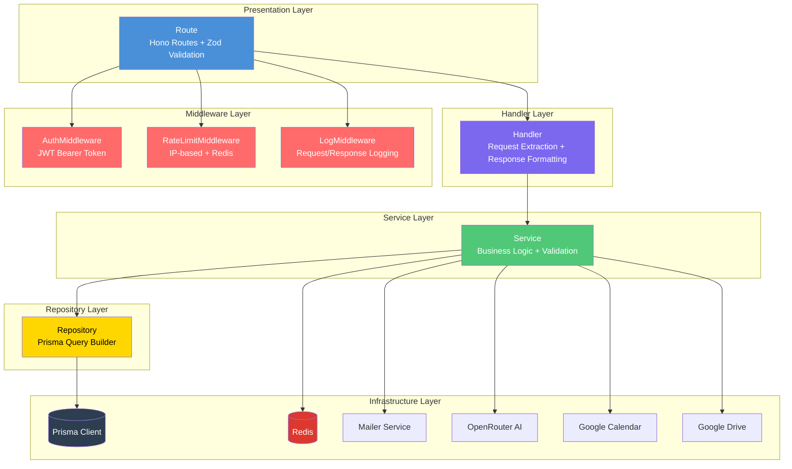

---

## 4.2 Core Package — Dependency Injection Container

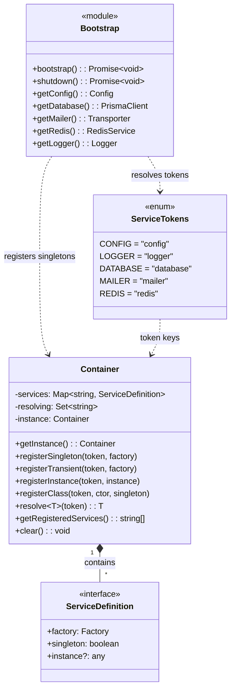

---

## 4.3 HTTP API Server — Request Lifecycle (Class Diagram)

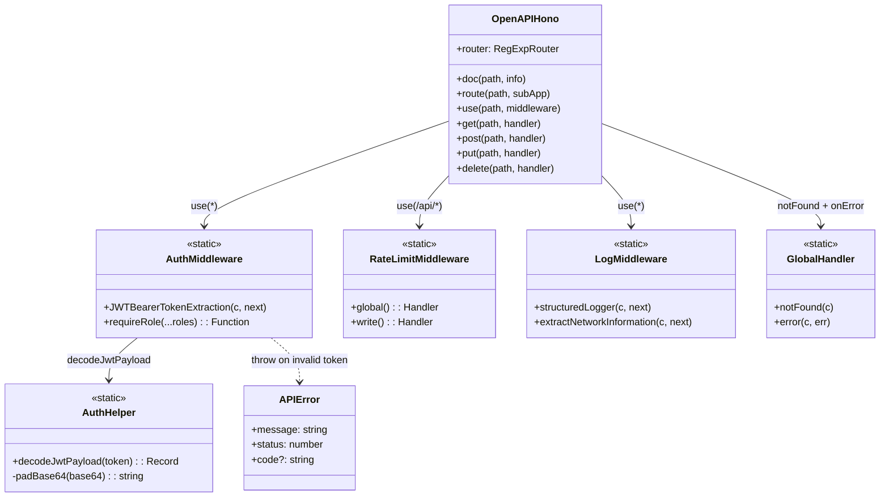

---

## 4.4 Generic Feature Module — Layered Pattern (UML)

> Setiap modul (jadwal, dosen, mahasiswa, penilaian, dll) mengikuti pola yang sama.

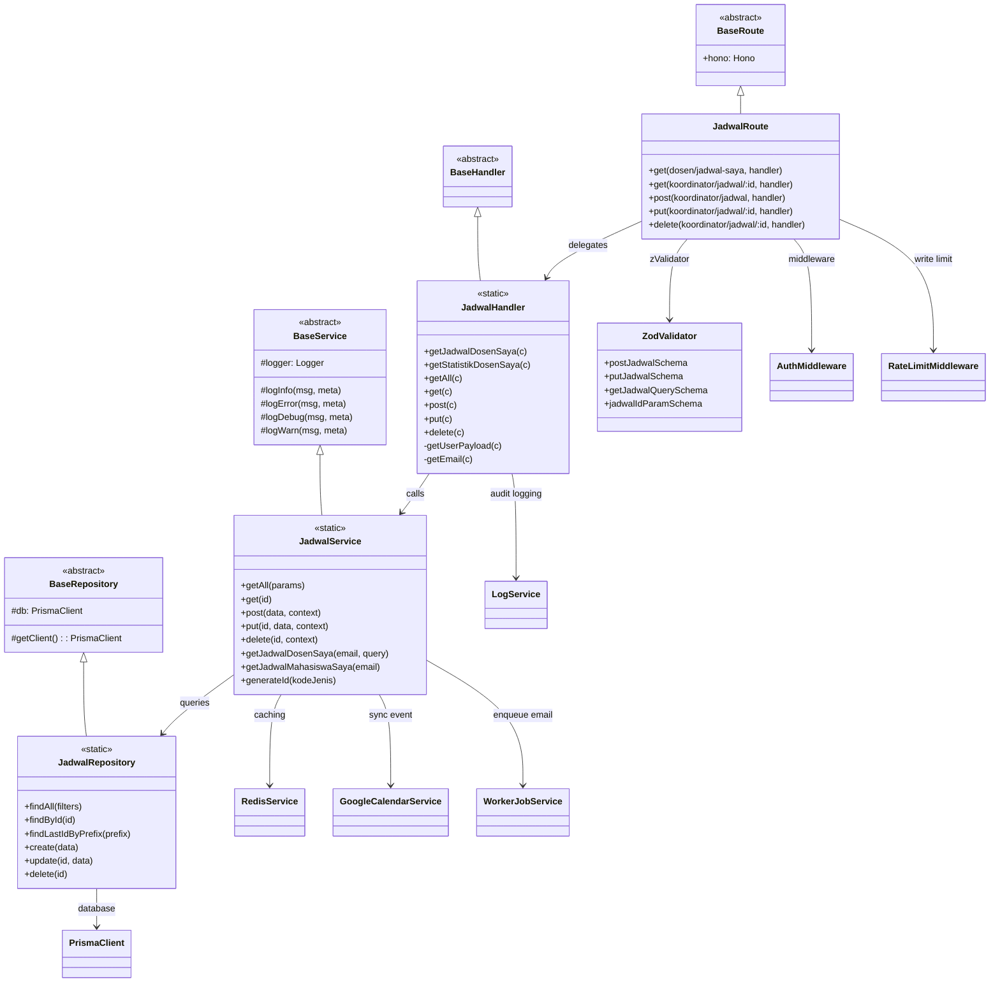

---

## 4.5 Infrastructure Layer — Singleton Services

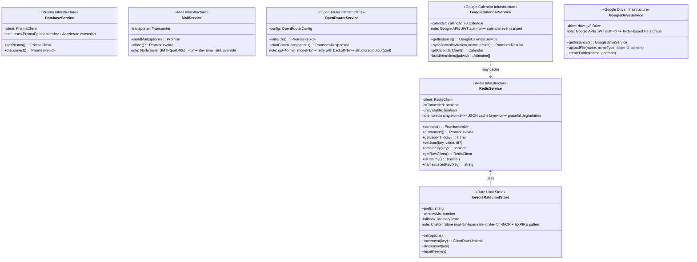

---

## 4.6 Worker Job Processing — Queue Architecture (Code)

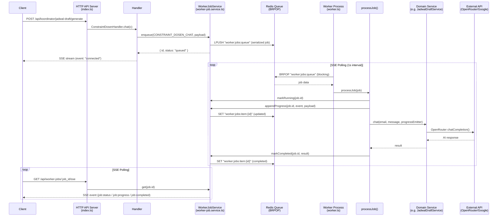

---

## 4.7 Worker Job Types — Dispatch Table

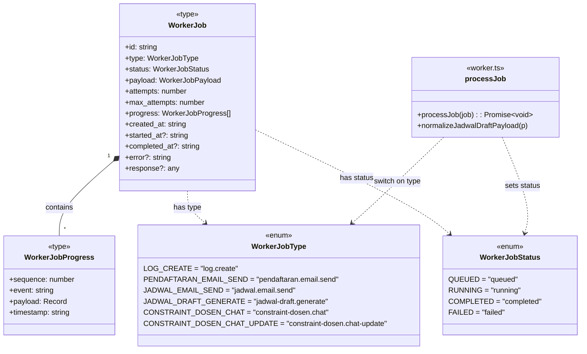

---

## 4.8 Domain Models — Prisma ER Diagram (Code)

```mermaid
erDiagram
    dosen {
        varchar(18) nip PK
        varchar(255) nama
        varchar(255) email UK
        varchar(14) no_hp UK
    }

    mahasiswa {
        varchar(11) nim PK
        varchar(255) nama
        varchar(36) email UK
        boolean aktif
        varchar(14) no_hp UK
    }

    ruangan {
        varchar(10) kode PK
        varchar(50) nama
        boolean status
        int urutan
    }

    jenis_seminar {
        varchar(20) kode UK
        varchar(100) nama
        text deskripsi
        boolean is_aktif
        int wajib_pembimbing
        int wajib_penguji
        boolean ada_ketua_sidang
    }

    jadwal {
        varchar(14) id PK
        timestamptz tanggal
        timestamptz waktu_mulai
        timestamptz waktu_selesai
        varchar(11) nim FK
        varchar(10) kode_ruangan FK
        varchar(20) id_jenis_seminar FK
        varchar(5) kode_tahun_ajaran
    }

    jadwal_draft {
        cuid id PK
        varchar(20) batch_id
        varchar(11) nim
        timestamptz tanggal
        timestamptz waktu_mulai
        timestamptz waktu_selesai
        varchar(10) kode_ruangan
        json list_dosen
        json llm_reasoning
        float confidence
        enum status DRAFT|APPROVED|REJECTED
    }

    penilaian {
        cuid id PK
        varchar(14) id_jadwal FK
        varchar(18) nip FK
        enum role PenilaiRole
    }

    detail_penilaian {
        cuid id PK
        cuid id_penilaian FK
        varchar(7) id_komponen FK
        float nilai
        text catatan
    }

    komponen_penilaian {
        varchar(7) id PK
        varchar(50) nama
        int persentase
        boolean is_aktif
        enum role PenilaiRole
    }

    pendaftaran {
        cuid id PK
        varchar(11) nim FK
        varchar(5) kode_tahun_ajaran
        varchar(50) id_pengajuan_fst UK
        varchar(20) id_jenis_seminar FK
        enum status_berkas PENDING|REVISI|APPROVED|REJECTED|UPLOAD_ULANG
        enum status_jadwal BELUM_JADWAL|SUDAH_JADWAL
        varchar(18) nip_pembimbing_1
        varchar(18) nip_pembimbing_2
        varchar(18) nip_penguji_1
        varchar(18) nip_penguji_2
        varchar(18) nip_ketua_sidang
    }

    data_pendaftaran {
        cuid id PK
        cuid id_pendaftaran FK
        cuid id_dokumen_template FK
        text nilai_text
        text nilai_file_url
        boolean nilai_boolean
        timestamptz nilai_date
        json nilai_json
    }

    dokumen_template {
        varchar(150) nama
        varchar(50) kode UK
        text deskripsi
        enum tipe_input FILE_UPLOAD|TEXT|URL|BOOLEAN|DATE|SELECT|MULTI_SELECT
        json opsi
        varchar(50) format_file
        int max_size_mb
        boolean is_special
    }

    requirement_dokumen {
        cuid id PK
        varchar(20) id_jenis_seminar FK
        cuid id_dokumen_template FK
        int urutan
        boolean is_wajib
        text keterangan_tambahan
    }

    bidang_keahlian {
        cuid id PK
        varchar(100) nama UK
    }

    keahlian_dosen {
        cuid id PK
        varchar(18) nip FK
        cuid id_bidang_keahlian FK
    }

    constraint_dosen {
        cuid id PK
        varchar(18) nip FK
        enum type AVAILABLE_TIME|UNAVAILABLE_TIME|PREFERENCE|LOCATION
        int hari
        timestamptz waktu_mulai
        timestamptz waktu_selesai
        text keterangan
        int priority
        boolean is_active
        json raw_data
    }

    log {
        cuid id PK
        timestamptz timestamp
        enum action CREATE|UPDATE|DELETE|GANTI_JADWAL|GANTI_DOSEN
        enum actor_type KOORDINATOR|DOSEN|MAHASISWA
        varchar actor_id
        enum entity_type JADWAL|PENILAIAN|PENDAFTARAN|...
        varchar entity_id
        json context
        json old_values
        json new_values
    }

    bobot_penilai {
        cuid id PK
        varchar(20) id_jenis_seminar FK
        enum role PenilaiRole
        int persentase
    }

    dosen ||--o{ keahlian_dosen : "has expertise"
    bidang_keahlian ||--o{ keahlian_dosen : "maps to"
    dosen ||--o{ penilaian : "grades"
    dosen ||--o{ constraint_dosen : "has constraints"
    mahasiswa ||--o{ jadwal : "has schedule"
    mahasiswa ||--o{ pendaftaran : "registers"
    ruangan ||--o{ jadwal : "holds"
    jenis_seminar ||--o{ jadwal : "defines type"
    jenis_seminar ||--o{ jadwal_draft : "defines type"
    jenis_seminar ||--o{ pendaftaran : "defines type"
    jenis_seminar ||--o{ requirement_dokumen : "requires docs"
    jenis_seminar ||--o{ bobot_penilai : "weight config"
    jadwal ||--o{ penilaian : "has assessments"
    penilaian ||--o{ detail_penilaian : "composed of"
    komponen_penilaian ||--o{ detail_penilaian : "evaluates"
    pendaftaran ||--o{ data_pendaftaran : "stores EAV data"
    dokumen_template ||--o{ data_pendaftaran : "defines field"
    dokumen_template ||--o{ requirement_dokumen : "linked to"
```

---

## 4.9 AI Constraint Chat — Code Flow (Class Diagram)

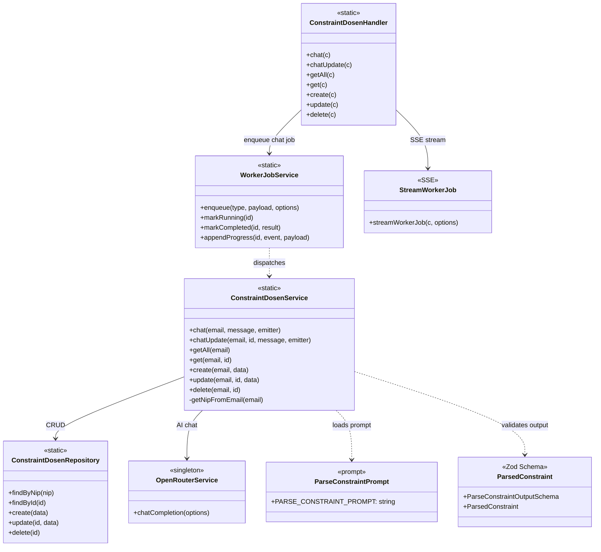

---

## 4.10 Jadwal Draft Generation — AI Scheduling Code Flow

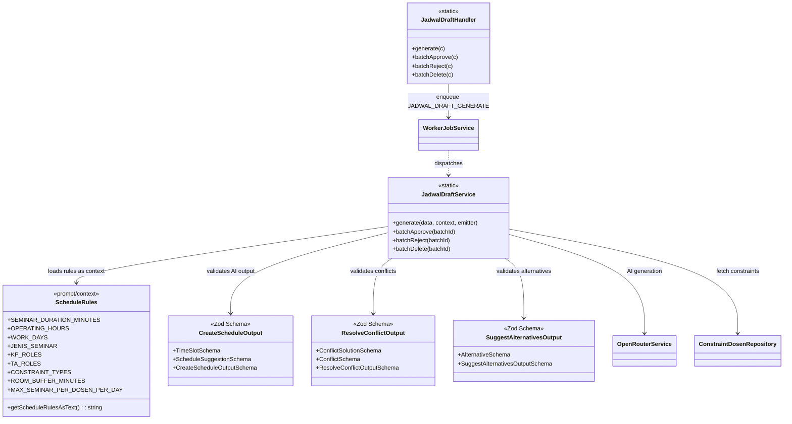

---

## 4.11 File Structure — Source Code Organization

```
src/
├── api.ts                          # API Router: registers all module routes
├── index.ts                        # HTTP Server entry point (APP_PROCESS=server)
├── worker.ts                       # Worker entry point (APP_PROCESS=worker)
│
├── core/
│   ├── bootstrap.ts                # DI container setup + service registration
│   ├── config.ts                   # Zod-validated env schema (374 lines)
│   ├── container.ts                # Singleton DI container (191 lines)
│   └── index.ts                    # Barrel exports
│
├── infrastructures/
│   ├── db.infrastructure.ts        # PrismaClient + PrismaPg adapter + Accelerate
│   ├── redis.infrastructure.ts     # ioredis singleton + JSON cache layer
│   ├── mail.infrastructure.ts      # Nodemailer SMTP + dev email sink
│   ├── openrouter.infrastructure.ts # OpenRouter API client + retry
│   ├── google-calendar.infrastructure.ts # Google Calendar v3 API
│   └── google-drive.infrastructure.ts    # Google Drive v3 API
│
├── middlewares/
│   ├── auth.middleware.ts           # JWT extraction + role checking
│   ├── rate-limit.middleware.ts     # IP-based rate limiting (Redis/memory)
│   └── log.middleware.ts           # Request/response structured logging
│
├── modules/                        # 20 feature modules
│   ├── bidang-keahlian/            # 7 files (handler, repository, route, service, type, validator, index)
│   ├── bobot-penilai/              # 7 files
│   ├── constraint-dosen/           # 7 files (+ AI chat)
│   ├── detail-penilaian/           # 7 files
│   ├── dokumen-template/           # 7 files
│   ├── dosen/                      # 6 files (no validator)
│   ├── jadwal/                     # 7 files (+ Calendar sync)
│   ├── jadwal-draft/               # 7 files (+ AI generation)
│   ├── jenis-seminar/              # 7 files
│   ├── keahlian-dosen/             # 7 files
│   ├── komponen-penilaian/         # 6 files
│   ├── log/                        # 7 files
│   ├── mahasiswa/                  # 7 files
│   ├── pendaftaran/                # 8 files (+ email.service)
│   ├── requirement-dokumen/        # 7 files
│   ├── ruangan/                    # 8 files (+ helper)
│   ├── tahun-ajaran/               # 7 files
│   ├── upload/                     # 5 files
│   └── worker-job/                 # 6 files (+ SSE)
│
├── handlers/                       # Cross-module handlers
│   ├── dosen-seminar.handler.ts
│   ├── global.handler.ts           # 404 + global error handler
│   ├── koordinator.handler.ts
│   └── penilaian.handler.ts
│
├── routes/                         # Cross-module routes
│   ├── dosen-seminar.route.ts
│   ├── global.route.ts
│   ├── koordinator.route.ts
│   └── penilaian.route.ts
│
├── services/                       # Cross-module services
│   ├── base.service.ts             # Abstract BaseService with logger
│   ├── dosen-seminar.service.ts
│   ├── global.service.ts
│   ├── koordinator.service.ts
│   └── penilaian.service.ts
│
├── repositories/                   # Cross-module repositories
│   ├── base.repository.ts          # Abstract BaseRepository with Prisma
│   └── penilaian.repository.ts
│
├── helpers/                        # Utility helpers
│   ├── auth.helper.ts              # JWT decode (base64)
│   ├── crypto.helper.ts
│   ├── dosen.helper.ts
│   ├── jadwal.helper.ts            # ID generation + timezone conversion
│   ├── jenis-seminar.helper.ts
│   ├── log-jadwal.helper.ts
│   ├── log-nilai.helper.ts
│   ├── log.helper.ts
│   ├── mahasiswa.helper.ts
│   └── tahun-ajaran.helper.ts
│
├── prompts/
│   ├── context/
│   │   └── schedule-rules.ts       # Typed scheduling rules for AI
│   └── output/
│       ├── constraint-schema.ts    # Zod schema: parsed constraint
│       └── schedule-schema.ts      # Zod schemas: schedule suggestions
│
├── types/
│   ├── container.type.ts           # DI service type definitions
│   ├── global.type.ts
│   ├── penilaian.type.ts
│   └── tahun_ajaran.type.ts
│
├── utils/
│   ├── api-error.util.ts           # Custom APIError class
│   ├── cache-invalidation.util.ts
│   ├── cache-key.util.ts           # Cache key hashing
│   ├── logger.util.ts              # Structured logger
│   ├── openrouter.util.ts          # OpenRouter request/response types
│   └── zod-error.util.ts           # Zod validation error formatting
│
└── validators/
    ├── dosen-seminar.validator.ts
    └── penilaian.validator.ts
```

---

## 4.12 Middleware Chain — Class Diagram

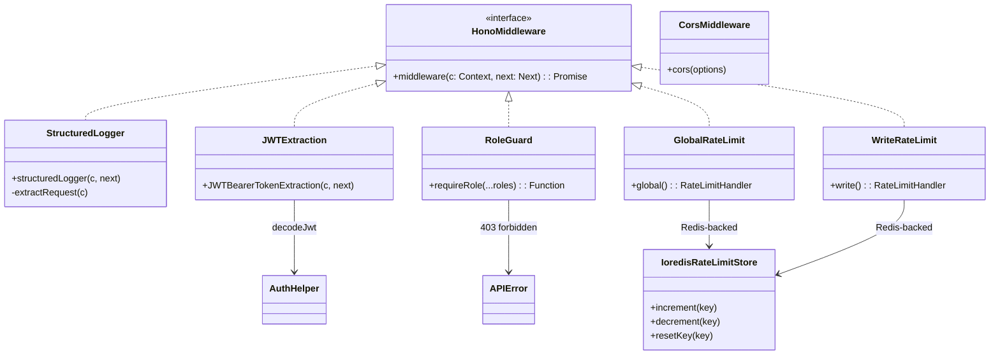

---

## 4.13 Cache Strategy — Code Pattern

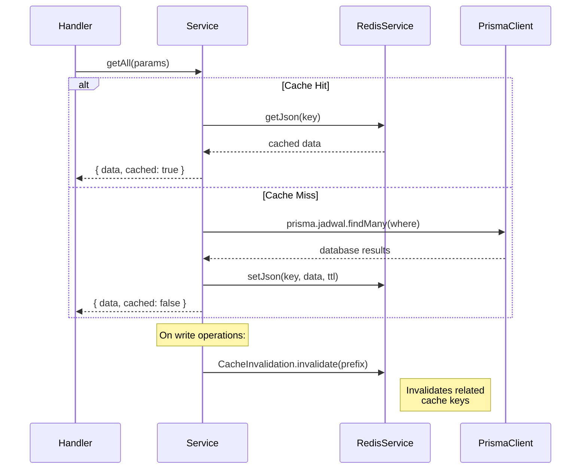
