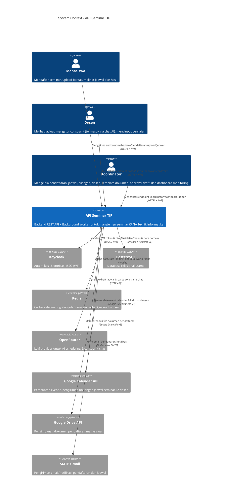
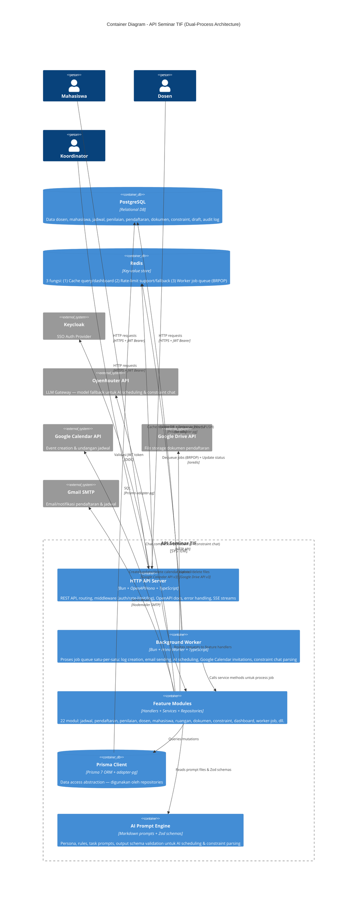
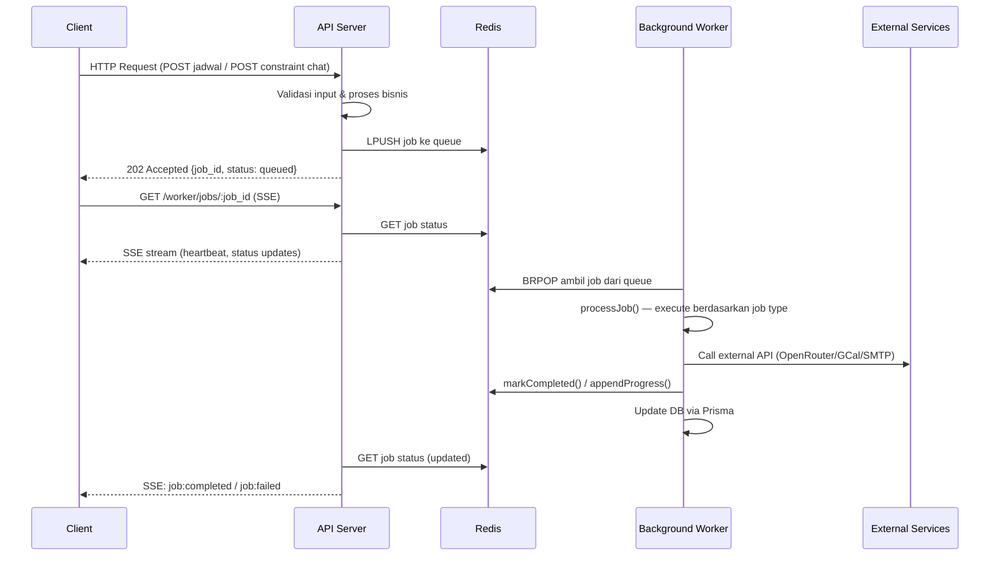
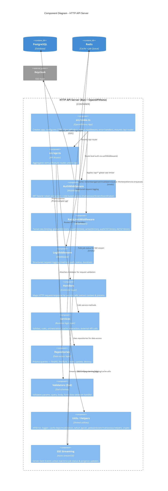
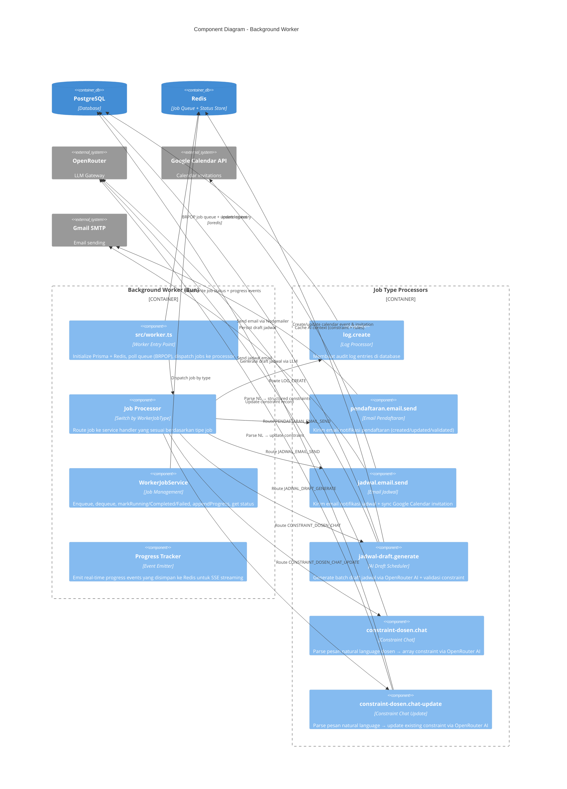
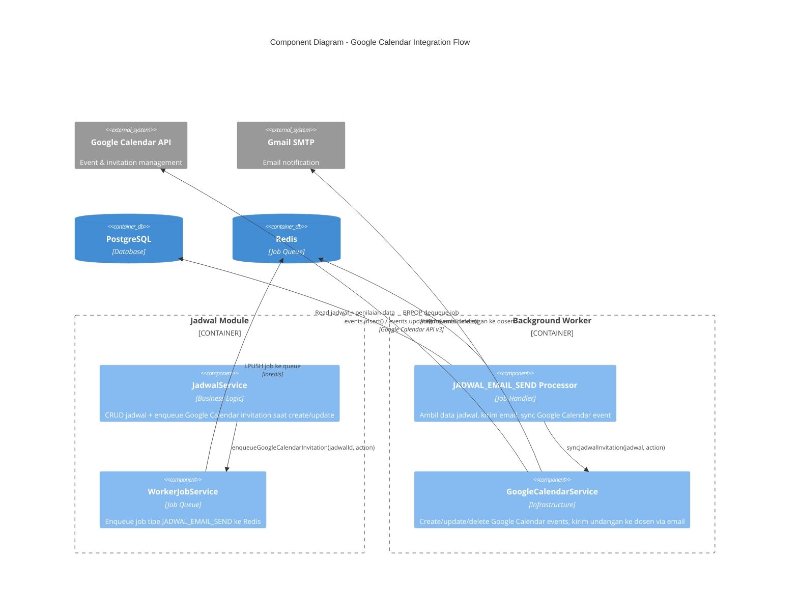

# Visualisasi Arsitektur — C4 Model (Updated)

Project: **API SEMINAR TIF** (`hono-api-seminar`)  
Stack utama: **Bun**, **Hono/OpenAPIHono**, **Prisma**, **PostgreSQL**, **Redis** (cache + job queue), **OpenRouter** (AI), **Google Calendar API**, **Google Drive API**, **SMTP Gmail**, **Worker Job Queue (SSE)**.

Dokumen ini memvisualisasikan arsitektur backend Sistem Manajemen Seminar KP & Tugas Akhir menggunakan pendekatan **C4 Model** yang dibatasi pada 3 level: **Context**, **Container**, dan **Component**.

> **Catatan Update:** Arsitektur terbaru mengadopsi **dual-process pattern** (API Server + Background Worker), integrasi **Google Calendar API** untuk undangan jadwal, **Koordinator Dashboard**, dan **AI Constraint Chat dengan SSE streaming**.

---

## Level 1 — System Context

### Keterangan Level 1

| Komponen | Deskripsi |
|----------|-----------|
| **Mahasiswa** | Pengguna utama yang mendaftar seminar, upload berkas, melihat jadwal |
| **Dosen** | Pembimbing/penguji yang mengatur ketersediaan (constraint), menginput penilaian |
| **Koordinator** | Staf prodi yang mengelola seluruh alur seminar dan monitoring dashboard |
| **API Seminar TIF** | Sistem utama — mencakup HTTP API Server **dan** Background Worker |
| **Keycloak** | Provider autentikasi enterprise (SSO), menghasilkan JWT token |
| **PostgreSQL** | Database utama (schema `public`) |
| **Redis** | Multi-purpose: cache query, rate limiting support, **dan** job queue untuk worker |
| **OpenRouter** | Gateway LLM untuk AI schedule generation dan constraint parsing |
| **Google Calendar API** | Membuat event kalender & mengirim undangan otomatis ke dosen terkait |
| **Google Drive API** | File storage untuk dokumen pendaftaran mahasiswa |
| **SMTP Gmail** | Email service untuk notifikasi pendaftaran |

---

## Level 2 — Container Diagram

### Diagram Alur Job Queue (Penjelasan Tambahan Level 2)

### Keterangan Level 2

| Container | Deskripsi |
|-----------|-----------|
| **HTTP API Server** | Menerima semua HTTP requests, menjalankan middleware, routing ke handlers, mengembalikan response |
| **Background Worker** | Proses **terpisah** yang berjalan independen dari API server. Mengambil job dari Redis queue (BRPOP), memprosesnya satu per satu, dan update status ke Redis + DB |
| **Feature Modules** | 22 modul bisnis dengan struktur konsisten: Route → Handler → Service → Repository |
| **Prisma Client** | ORM layer yang digunakan oleh repositories untuk query database |
| **AI Prompt Engine** | Koleksi prompt templates (Markdown) dan Zod schemas untuk validasi output AI |
| **Redis** | 3 fungsi utama: cache, rate limiting, **dan job queue** (list BRPOP/LPUSH) |

---

## Level 3 — Component Diagram: HTTP API Server

---

## Level 3 — Component Diagram: Background Worker

---

## Level 3 — Component Diagram: Feature Modules

```mermaid
C4Component
    title Component Diagram - Feature Modules (Updated)

    Person(mahasiswa, "Mahasiswa")
    Person(dosen, "Dosen")
    Person(koordinator, "Koordinator")

    Container_Boundary(features, "Feature Modules (22 modules)") {

        Component(jadwal, "Jadwal Module", "Route + V + H + S + R", "CRUD jadwal seminar + conflict detection + Google Calendar invitation enqueue")
        Component(jadwalDraft, "Jadwal Draft AI Module", "Route + V + H + S + R", "Generate batch draft jadwal via AI, approve/reject workflow, validasi constraint otomatis")
        Component(pendaftaran, "Pendaftaran Module", "Route + V + H + S + R", "Pengajuan & pengelolaan pendaftaran seminar, EAV data_pendaftaran, status tracking")
        Component(penilaian, "Penilaian Module", "Route + V + H + S + R", "Input & manajemen penilaian seminar, detail komponen nilai per role")
        Component(dosenMod, "Dosen Module", "Route + V + H + S + R", "CRUD data dosen (NIP, nama, email)")
        Component(mahasiswaMod, "Mahasiswa Module", "Route + V + H + S + R", "CRUD data mahasiswa (NIM, nama, status aktif)")
        Component(ruangan, "Ruangan Module", "Route + V + H + S + R + Helper", "Data ruangan + deteksi konflik jadwal per ruangan")
        Component(constraint, "Constraint Dosen Module", "Route + V + H + S + R", "CRUD constraint dosen + AI chat (NL parsing via OpenRouter) + SSE streaming progress")
        Component(koordinatorDashboard, "Koordinator Dashboard Module", "Route + H + S", "Statistik dashboard, semester stats, recent activity, lecturer workload monitoring")
        Component(masterData, "Master Data Modules", "Jenis Seminar + Tahun Ajaran + Bobot Penilai + Bidang Keahlian + Komponen Penilaian", "Konfigurasi master: jenis seminar, tahun ajaran, bobot penilai, bidang keahlian, komponen penilaian")
        Component(dokumenTemplate, "Dokumen Template Module", "Route + V + H + S + R", "Template dokumen pendaftaran (FILE_UPLOAD/TEXT/URL/BOOLEAN/DATE/SELECT)")
        Component(requirementDokumen, "Requirement Dokumen Module", "Route + V + H + S + R", "Requirement dokumen per jenis seminar + tahun ajaran")
        Component(upload, "Upload Module", "Route + H + S", "Upload/delete dokumen pendaftaran via Google Drive API")
        Component(log, "Audit Log Module", "Route + H + S + R", "Polymorphic audit log (entity_type + entity_id) untuk semua perubahan data")
        Component(workerJob, "Worker Job Module", "Route + H + S + SSE", "Monitor job status via polling + SSE streaming real-time progress")
    }

    ContainerDb(postgres, "PostgreSQL", "Relational DB")
    ContainerDb(redis, "Redis", "Cache + Job Queue")
    System_Ext(openrouter, "OpenRouter", "LLM AI service")
    System_Ext(gdrive, "Google Drive", "File storage")
    System_Ext(gcal, "Google Calendar", "Calendar invitations")
    System_Ext(smtp, "Gmail SMTP", "Email service")

    Rel(mahasiswa, pendaftaran, "Mengajukan pendaftaran")
    Rel(mahasiswa, jadwal, "Melihat jadwal seminar")
    Rel(mahasiswa, upload, "Upload dokumen pendaftaran")
    Rel(dosen, jadwal, "Melihat jadwal seminar")
    Rel(dosen, penilaian, "Input penilaian nilai")
    Rel(dosen, constraint, "CRUD constraint + chat AI (NL)")
    Rel(koordinator, jadwal, "Mengelola jadwal seminar")
    Rel(koordinator, jadwalDraft, "Generate/approve/reject draft AI")
    Rel(koordinator, pendaftaran, "Verifikasi pendaftaran")
    Rel(koordinator, koordinatorDashboard, "Monitoring statistik & workload")
    Rel(koordinator, masterData, "Mengelola master data")
    Rel(koordinator, dokumenTemplate, "Mengelola template dokumen")
    Rel(koordinator, ruangan, "Mengelola ruangan")
    Rel(koordinator, log, "Melihat audit log")

    Rel(jadwal, postgres, "Read/write jadwal")
    Rel(jadwal, redis, "Enqueue Google Calendar job via WorkerJobService")
    Rel(jadwalDraft, openrouter, "Generate draft jadwal via LLM")
    Rel(jadwalDraft, redis, "Cache AI scheduling context")
    Rel(jadwalDraft, postgres, "Persist draft jadwal")
    Rel(pendaftaran, postgres, "Read/write pendaftaran + EAV data")
    Rel(pendaftaran, smtp, "Enqueue email notifikasi via WorkerJobService")
    Rel(penilaian, postgres, "Read/write penilaian + detail penilaian")
    Rel(upload, gdrive, "Upload/delete files")
    Rel(upload, postgres, "Simpan metadata file")
    Rel(constraint, postgres, "Read/write constraint dosen")
    Rel(constraint, openrouter, "Parse NL → structured constraints (via WorkerJobService)")
    Rel(constraint, redis, "Enqueue constraint chat job + SSE progress")
    Rel(koordinatorDashboard, postgres, "Query stats, workload, activity")
    Rel(koordinatorDashboard, redis, "Cache dashboard stats")
    Rel(log, postgres, "Persist audit log")
    Rel(workerJob, redis, "Poll job status + SSE stream progress events")
```

---

## Level 3 — Component Diagram: Integrasi Google Calendar

---

## Catatan Pembacaan Diagram

### Struktur C4 yang Digunakan
- **Level 1 (System Context):** Aktor → Sistem Utama → External Systems — untuk non-teknis stakeholder
- **Level 2 (Container):** API Server + Background Worker (dual-process) + shared infrastructure — untuk technical architect
- **Level 3 (Component):** Detail internal komponen per container — untuk developer

### Perubahan dari Versi Sebelumnya
1. **Background Worker** ditambahkan sebagai container terpisah (dual-process architecture)
2. **Google Calendar API** ditambahkan sebagai external system (terpisah dari Google Drive)
3. **Worker Job Queue** (Redis BRPOP/LPUSH) menjadi jembatan antara API Server dan Worker
4. **Koordinator Dashboard Module** ditambahkan sebagai feature module baru
5. **AI Constraint Chat + SSE** streaming ditambahkan di Constraint Dosen Module
6. **Google Calendar Integration Flow** ditambahkan sebagai Level 3 diagram terpisah untuk menunjukkan integrasi kompleks
7. **Redis** diupdate fungsinya: cache + rate limit **+ job queue**
8. **Jadwal Module** diupdate: sekarang meng-enqueue Google Calendar invitation saat create/update

### Tools untuk Render Diagram
- **Mermaid C4 syntax** — gunakan Mermaid versi ≥ 10 dengan plugin C4
- **Renderers:** Mermaid Live Editor, GitHub/GitLab Markdown, VS Code (Mermaid extension), Notion, dll.
- Jika C4 syntax tidak ter-render, gunakan `C4Context`, `C4Container`, `C4Component` tags yang sesuai

### Diagram yang Tersedia
| Level | Diagram | File Location |
|-------|---------|---------------|
| Level 1 | System Context | `docs/architecture-c4.md` — Section "Level 1" |
| Level 2 | Container Diagram | `docs/architecture-c4.md` — Section "Level 2" |
| Level 2 | Job Queue Sequence | `docs/architecture-c4.md` — Section "Level 2" (bonus) |
| Level 3 | HTTP API Server Components | `docs/architecture-c4.md` — Section "Level 3: HTTP API Server" |
| Level 3 | Background Worker Components | `docs/architecture-c4.md` — Section "Level 3: Background Worker" |
| Level 3 | Feature Modules Components | `docs/architecture-c4.md` — Section "Level 3: Feature Modules" |
| Level 3 | Google Calendar Integration | `docs/architecture-c4.md` — Section "Level 3: Google Calendar Integration" |
